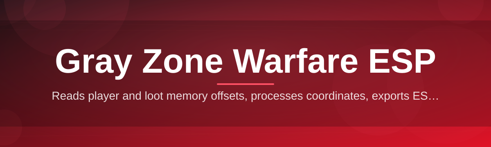
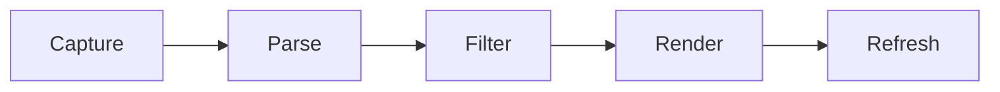

# gray-zone-warfare-overlay 🛰️🎯

  

*A community-built situational awareness overlay for Gray Zone Warfare, engineered for clarity on the map, not clutter on your screen.*

  

## 🌱 Overview

Every project has an origin story, and this one started the way most good tools do — out of frustration. A small group of Gray Zone Warfare players kept dying to threats they never saw coming: a squad rotating through a treeline, a contact holding an angle from a compound window, a raid timer nobody could track mid-firefight. Existing tools were either bloated, abandoned, or built with zero regard for readability. So a handful of contributors sat down, sketched an overlay architecture on a whiteboard, and `gray-zone-warfare-overlay` was born as a weekend experiment that refused to stay small.

Today it has grown into a full community-maintained ESP overlay for Gray Zone Warfare, focused on one core idea: **information density without visual noise**. It renders player positions, extraction windows, loot-rich points of interest, and contact distances on a clean heads-up layer that sits above the game, giving squads the map-reading advantage that separates a clean extraction from a wipe. It's built for raiders who want to make sharper tactical calls — pushing a compound with confidence, rotating away from a stacked lobby, or simply knowing when a fight is winnable before committing.

This isn't a black-box binary passed around a Discord server. It's an open, transparent, actively maintained project with a real issue tracker, real contributors, and a roadmap shaped by the people who actually play the game. Whether you're a solo operator scouting extraction routes or a squad lead calling rotations, this overlay is built to be *read at a glance*, not studied like a spreadsheet.

---

## 🔭 What This Thing Actually Does

1. **Contact Rendering** — Tracks and displays player positions across the map in real time, using a distance-aware layer so nearby threats visually dominate over far-off noise.

2. **Loot Point Highlighting** — Surfaces high-value points of interest and known loot clusters directly on the overlay, so route planning happens before you even land in the zone.

3. **Extraction Timer Sync** — Keeps live extraction windows visible at all times, removing the guesswork of tabbing out or squinting at a corner HUD element.

4. **Threat Distance Callouts** — Converts raw coordinates into readable distance and bearing text, so squad comms sound like "150 south, compound roof" instead of vague pointing.

5. **Squad-Aware Color Coding** — Differentiates friendlies, unknowns, and hostiles with a color language that's readable in a firefight, not just in a settings preview.

6. **Low-Profile Rendering Engine** — Draws the overlay with a lightweight compositor pass designed to stay smooth even on modest hardware — no frame-time tax for situational awareness.

7. **Configurable Radar Radius** — Dial the detection radius in or out depending on whether you're holding a tight building fight or scanning an open compound approach.

8. **Session Logging (Optional)** — Keep a local, opt-in log of engagements for after-action review — great for squads that actually debrief instead of just queueing again.

> [!TIP]
> New to the project? Start with the default preset before touching any sliders. It's tuned by contributors who've spent hundreds of hours dialing in readability versus clutter.

---

## 🚀 Getting In The Zone (Setup)

1. Visit the landing page using the download button above or below — that page always points to the current build.

2. Download the latest packaged release for Windows. No installer wizard, no bundled toolbars — just the overlay binary and its config folder.

3. Run the executable. On first launch, Windows SmartScreen may flag it because it's a newer publisher — click "More info" → "Run anyway."

4. Launch Gray Zone Warfare, alt-tab back if needed, and the overlay will attach automatically. Adjust settings through the in-overlay menu once you're in a raid.

> [!NOTE]
> The overlay runs standalone. There's nothing to compile, no package managers, no scripts to execute — download, run, done.

---

## 🖥️ System Requirements

| Requirement | Detail |
|---|---|
| OS | Windows 10 (64-bit) or Windows 11 |
| Dependencies | None — fully standalone executable |
| Storage | Under 200 MB |
| GPU | Any DirectX 11-capable GPU from the last decade |
| Permissions | Standard user; no elevated install required |

> [!IMPORTANT]
> This tool does not modify game files. It renders an external overlay layer, keeping your Gray Zone Warfare installation untouched.

---

## ⚙️ How It Works

The overlay operates as a translucent render layer that sits between your eyes and the game window, pulling positional data and painting it into a clean, low-latency visual pass.

1. **Capture** — The overlay attaches to the running game process and begins reading positional data streams.

2. **Parse** — Raw coordinates and entity states get normalized into a consistent internal format.

3. **Filter** — Distance thresholds, squad-color rules, and radar radius settings trim the data down to what's actually useful.

4. **Render** — A lightweight compositor draws contacts, loot points, and timers directly onto the screen without touching game memory rendering paths.

5. **Refresh** — The loop repeats at a high tick rate, keeping the overlay synced to what's actually happening in your raid.

---

## 🧩 Troubleshooting

<strong>The overlay launches but I don't see anything in-game.</strong>

Make sure Gray Zone Warfare is running in Borderless or Windowed mode. True Fullscreen Exclusive mode can prevent overlay compositing on some GPU drivers.

<strong>Windows SmartScreen won't let me run the executable.</strong>

This is expected for newer independent publishers. Click "More info," then "Run anyway." The binary is unsigned but fully open for community review.

<strong>Contact markers feel delayed or jittery.</strong>

Try lowering the render refresh interval in Settings → Performance. Older GPUs benefit from a slightly reduced tick rate for smoother visuals.

<strong>My antivirus flagged the download.</strong>

Overlay tools that read process data commonly trigger heuristic flags. Check the project's issue tracker — this is a known, discussed false positive with guidance on whitelisting.

<strong>Can I run this alongside voice comms and streaming software?</strong>

Yes. The overlay renders independently and does not conflict with Discord overlays, OBS capture, or common streaming stacks.

---

## 🎛️ UI, Themes & Shortcuts

The interface is built around one philosophy: everything you need should be reachable without breaking your aim.

| Shortcut | Action |
|---|---|
| `F1` | Toggle overlay visibility |
| `F2` | Cycle radar radius presets |
| `F3` | Open settings panel |
| `F4` | Toggle session logging |
| `Insert` | Show/hide contact distance labels |

- Multiple color themes ship out of the box: **Tactical Dark**, **High-Contrast Amber**, and **Minimal Outline**.

- Font scaling and opacity sliders let you tune readability for any monitor size.

- Settings persist locally in a config file — no account, no cloud sync, no telemetry required.

> [!WARNING]
> Avoid setting opacity too low on bright maps — some contributors have reported missing close-range contacts when the overlay blends into terrain colors.

---

## 🤝 Contributing & Community

This project grew because people showed up, not because one person decided to gatekeep it. If you've found a bug, thought of a feature, or want to improve rendering performance, open an issue — seriously, they get read.

> [!TIP]
> Look for issues tagged `good-first-issue`. They're curated specifically for new contributors who want a meaningful, low-friction way to get involved.

- Bug reports should include your Windows version, GPU, and a short repro description.

- Feature requests are welcome as GitHub Discussions before becoming formal issues.

- Pull requests should stay focused — one change, one purpose, clear description.

We maintain a friendly, low-ego contribution culture. No question is "too basic," and no PR is too small to review with care.

  

---

## 📜 License

Released under the [MIT License](LICENSE), 2026. Use it, fork it, learn from it — just keep the license notice intact.

---

## ⚠️ Disclaimer

> This project is an independent, community-built overlay created for educational and situational-awareness purposes. It is not affiliated with, endorsed by, or associated with the developers or publisher of Gray Zone Warfare. Use of third-party overlay tools may carry risk depending on the game's current terms of service — review those terms and use this project at your own discretion. Contributors provide this software "as is," without warranty of any kind.

